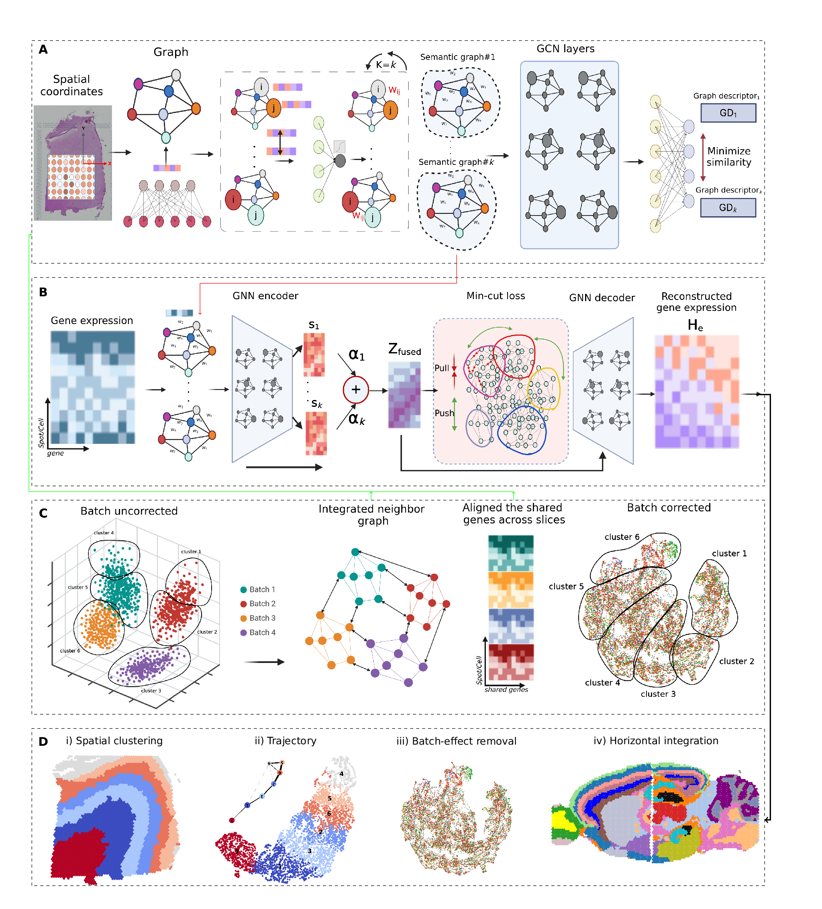

SemanticST: Spatially informed semantic graph learning for effective clustering and integration of spatial transcriptomics
==========================================================================================================================
   
.. toctree::
   :maxdepth: 1
   :caption: Tutorials

   source/notebooks/DLPFC
   source/notebooks/mouse_brain_Visium
   source/notebooks/Mouse_brain_slideseq
   source/notebooks/Stereo-seq mouse olfactory bulb
   source/notebooks/Mouse_embryo_E9.5
   source/notebooks/Breast_cancer
   source/notebooks/Liver_cancer_non_responder
   source/notebooks/Liver_cancer_responder
   source/notebooks/Integration
   source/notebooks/Integration_vertical
   

   
   
